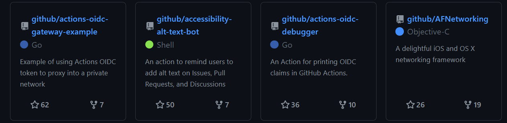
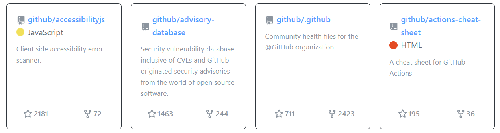

# Github Repo Cards

Show customizable GitHub repository cards on your website in just a couple of HTML lines.

[](https://www.npmjs.com/package/github-repository-cards)

#### Dark mode


#### Light mode


## Usage

Add the necessary scripts and styles from a CDN.

````html
<script src="https://cdn.jsdelivr.net/npm/github-repository-cards@latest/app.js" defer></script>
<link rel="stylesheet" href="https://cdn.jsdelivr.net/npm/github-repository-cards@latest/style.css">
````

#### Show user repos

````html
<section class="github-repo-cards" data-user="github"></section>
````

#### Show user starred repos
````html
<section class="github-repo-cards" data-user="github" data-starred=true></section>
````

## Parameters

The cards are customizable. You can pass parameters to the section to make changes to the cards.

### data-user

Your GitHub username.

### data-starred

Pass `data-starred` (default `false`) along with `data-user` to display latest user starred repos.

### data-target-blank

Pass `data-target-blank` (default `true`) to open the links in a new tab.

### data-count

Pass `data-max-count` (default `12`) to specify the maximum number of repos to show.

### data-background

Pass `data-background` (default `#0d1117`) to configure the background of the container. The value can be any CSS-acceptable color value.
You can also add custom CSS to your own project.
